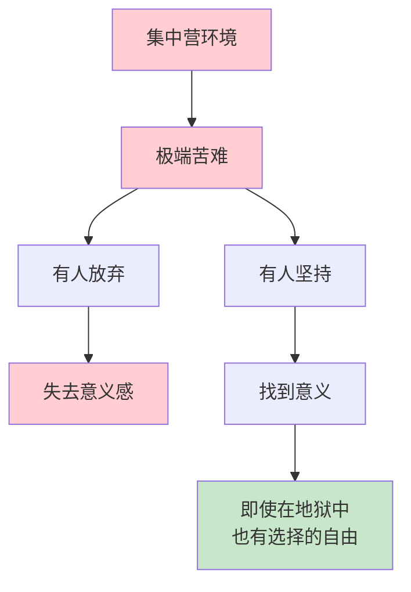
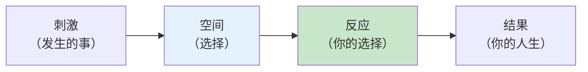
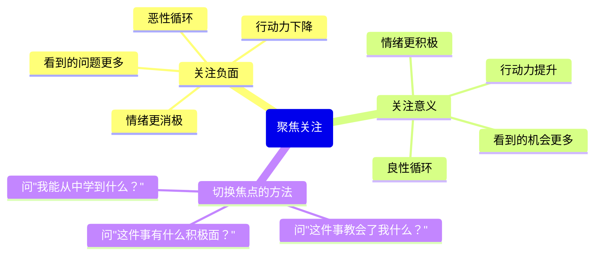

# ○●《思维的囚徒》核心内容A：从集中营到职场的意义之旅●◆

---

## 一、Frankl的故事：在极端环境中发现的真理

### ◆ 集中营中的观察

Viktor Frankl是奥地利犹太裔精神病学家，在二战期间被关押在纳粹集中营中。在那里，他目睹了人类最极端的苦难，但也发现了人类最深刻的力量。

Frankl观察到，那些能够在集中营中存活下来的人，往往不是身体最强壮的，而是**找到了意义**的人。那些知道自己"为什么"而活的人，能够承受几乎任何"怎样"。

### ○ 关键洞察：刺激与反应之间的空间

这是Frankl最深刻的洞见，也是整本书的核心：

> "在刺激和反应之间有一个空间。在这个空间里，我们有选择反应的能力。我们的成长和幸福，就在我们的反应中。"

这个"空间"是**自由意志**存在的证明。无论外界发生了什么，你始终可以选择如何回应。

---

## 二、七项意义疗法原则（前四项）

### ◆ 原则1：暂停

**核心**：在刺激和反应之间创造一个"暂停"的空间。

**为什么重要**：大多数人的反应是自动的、习惯性的。暂停让你从"自动反应"转向"有意识选择"。

**实践方法**：
- 当你感到愤怒、焦虑或恐惧时，先数到3
- 深呼吸一次
- 问自己："我现在有几种反应可以选择？"

### ○ 场景案例

**场景**：领导在会议上公开批评了你的方案。

**自动反应**：愤怒、防御、反驳、内心怨恨。

**暂停后**：深呼吸，问自己："我可以选择什么反应？"
- 选择A：当场反驳（短期爽，长期损失信任）
- 选择B：沉默忍受（短期安全，长期积累怨恨）
- 选择C：冷静回应："谢谢你的反馈，我想了解具体的改进建议"（建设性）

### ◆ 原则2：自由选择

**核心**：承认你有选择态度的能力——这是你不可剥夺的自由。

**实践方法**：
- 在任何困境中问自己："我能选择什么态度？"
- 记住：你不能控制发生的事，但你能控制对它的态度
- 把"我没办法"换成"我可以选择……"

### ○ 场景案例

**场景**：你的项目被取消了，几个月的努力白费。

**态度选择**：
- 态度A："一切都毁了，我的努力白费了"——受害者心态
- 态度B："这几个月的经验让我成长了很多"——成长心态
- 态度C："这个项目虽然取消了，但我学到了X、Y、Z，这些会帮助我下一个项目"——意义创造

### ◆ 原则3：聚焦关注

**核心**：你的注意力决定你的现实。你关注什么，什么就会在你的生活中变大。

### ○ 场景案例

**场景**：公司裁员，你很幸运留下来了，但工作量增加了。

**关注负面**："太不公平了，凭什么我要做这么多？公司太坏了。"

**关注意义**："这是一个证明我价值的机会。我学到的新技能会让我更有竞争力。"

### ◆ 原则4：意义发现

**核心**：意义存在于每个情境中，你的任务是发现它。

Frankl认为，意义不是被"创造"出来的虚无之物，而是**客观存在于每个情境中**的。你的任务是用觉察力去发现它。

**三个发现意义的途径**：
1. **通过创造**：你做了什么？你贡献了什么？
2. **通过体验**：你经历了什么？你感受到了什么？
3. **通过态度**：你如何面对无法改变的事？

---

## 三、工作与意义

### ○ 工作意义的三个层次

| 层次 | 特征 | 例子 | 满意度 |
|------|------|------|-------|
| 职业（Job） | 为了钱而做 | 做不喜欢但高薪的工作 | 低 |
| 事业（Career） | 为了成就感和地位 | 追求晋升和认可 | 中 |
| 使命（Calling） | 为了更大的意义 | 觉得工作让世界更好 | 高 |

### ◆ 从"职业"到"使命"的转变

Pattakos指出，即使是最平凡的工作，也可以从"职业"转变为"使命"。关键在于**你如何理解自己的工作与他人之间的关系**。

**案例**：

三个工人在砌墙。
- 第一个说："我在砌墙。"（职业）
- 第二个说："我在建一栋大楼。"（事业）
- 第三个说："我在为这个社区建造一座美丽的教堂。"（使命）

同样的工作，不同的意义感，带来完全不同的体验。

---

## ◆ 行动清单

| 序号 | 行动 | 完成标准 |
|------|------|---------|
| 1 | 回顾最近一次情绪反应 | 写下你当时选择了什么反应 |
| 2 | 练习"暂停"3次 | 在每次被激怒时暂停3秒 |
| 3 | 列出你当前的一个困境 | 用"态度选择"重新审视 |
| 4 | 做一次"焦点切换"练习 | 从负面转向意义 |
| 5 | 用三个途径审视你的工作 | 创造/体验/态度 |

---

○ 下一节：《思维的囚徒》核心内容B——后三项原则与实践工具

