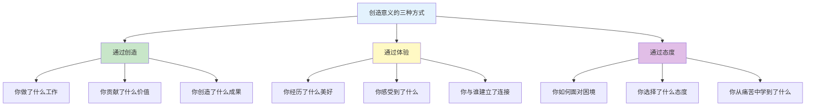
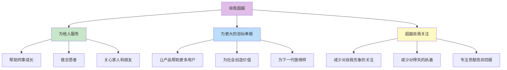

# ●◆《思维的囚徒》核心内容B：意义创造与自我超越◆○

---

## 一、七项意义疗法原则（后三项）

### ◆ 原则5：意义创造

**核心**：你可以通过行动创造意义——意义不是被动等待的，而是主动创造的。

Frankl提出了三种创造意义的方式：



**场景演练**：

你在工作中感到无聊和没有意义。

**通过创造**：你能做什么来增加工作的价值？
- 改进一个流程，让同事的工作更轻松
- 主动承担一个新项目，学习新技能

**通过体验**：你能从工作中体验到什么？
- 与同事建立更深的关系
- 从每天的挑战中获得成长感

**通过态度**：你如何面对无法改变的部分？
- 接受工作中的无聊部分，把它们看作"支持我实现更大目标的必要环节"

### ○ 原则6：意义强化

**核心**：意义需要通过持续的实践来巩固——它不是一次性的发现，而是持续的培养。

**强化方法**：

| 方法 | 具体做法 | 频率 |
|------|---------|------|
| 反思日记 | 每天记录"今天发现了什么意义" | 每天 |
| 感恩练习 | 写下3件你感恩的事 | 每天 |
| 意义对话 | 与同事讨论工作的意义 | 每周 |
| 服务他人 | 做一件不求回报的事 | 每周 |
| 回顾里程碑 | 回顾你的人生意义时刻 | 每月 |

### ◆ 原则7：自我超越

**核心**：真正的意义总是指向自身之外——你为比自己更大的事物服务。

这是Frankl意义疗法的最深层原则。他认为：

> "幸福不能被追求，它必须是随之而来的——作为一个人献身于比自己更大的事业的副产品。"



---

## 二、意义疗法在职场中的应用

### ○ 常见职场困境与意义回应

| 困境 | 无意义回应 | 有意义回应 |
|------|-----------|-----------|
| 工作无聊 | "这份工作太无聊了" | "我在做这个工作时，能学到什么？能为谁创造价值？" |
| 领导不公 | "领导太不公平了" | "我能从中学到什么？如何在这种情况下仍然做正确的事？" |
| 同事冲突 | "他就是针对我" | "这个冲突教会了我什么？我如何用协同思维解决它？" |
| 项目失败 | "一切都完了" | "这次失败让我学到了什么？下次如何做得更好？" |
| 职业发展停滞 | "我没有前途了" | "即使职位没有提升，我还能在哪些方面成长？" |

### ◆ "意义发现"工作表

每次面对工作困境时，填写以下表格：

```
┌─────────────────────────────────────┐
│       意义发现工作表                │
├─────────────────────────────────────┤
│ ◇ 当前困境：                        │
│                                    │
│ ○ 通过创造——我能做什么来增加价值？ │
│                                    │
│ ● 通过体验——我能从中学到什么？      │
│                                    │
│ ◆ 通过态度——我选择什么态度？        │
│                                    │
│ ◇ 我为比自己更大的事物贡献了什么？  │
│                                    │
│ ○ 我今天的选择会让我成为什么样的人？│
└─────────────────────────────────────┘
```

---

## 三、常见陷阱与应对

<div style="background: #ffebee; padding: 16px; border-left: 4px solid #f44336;">
⚠️ 常见陷阱：这些行为会让你"以为"在寻找意义，实际上不是
</div>

### ◆ 陷阱1：等待"天启式"的意义

认为意义会在某一天突然"降临"，像闪电一样照亮你的人生。

**应对**：意义不是突然发现的，而是在日常实践中逐渐显现的。从小事开始——今天的工作中有什么意义？

### ○ 陷阱2：把"意义"等同于"快乐"

认为有意义的生活就一定快乐。

**应对**：Frankl明确指出，有意义的生活可能充满痛苦和困难。意义和快乐是两回事。意义是关于"为什么"，快乐是关于"感受"。

### ◆ 陷阱3：认为"我的工作没有意义"

认为只有某些"高尚"的职业才有意义，而自己的工作没有。

**应对**：任何工作都可以有意义，关键在于你如何理解它与他人之间的关系。一个清洁工可以让医院保持卫生，间接拯救生命。

---

## 四、意义感自评量表

### ○ 请在每个维度上给自己打分（1-10分）

| 维度 | 1分（完全不符合） | 5分（部分符合） | 10分（完全符合） | 你的分数 |
|------|-----------------|---------------|----------------|---------|
| 我能在日常工作中发现意义 | 完全看不到 | 偶尔看到 | 总是能看到 | |
| 我在困境中能选择积极态度 | 总是消极 | 有时能转换 | 总是能转换 | |
| 我的工作让我感到充实 | 完全空虚 | 部分充实 | 非常充实 | |
| 我为比自己更大的事物服务 | 只关注自己 | 偶尔为他人 | 经常为他人 | |
| 我知道自己"为什么"而工作 | 完全不知道 | 部分清楚 | 非常清楚 | |

**评分参考**：
- 10-20分：意义感较弱，建议从"暂停"和"态度选择"开始练习
- 21-35分：有一定意义感，重点突破薄弱环节
- 36-50分：意义感良好，可以在更复杂的场景中应用

---

## ◆ 行动清单

| 序号 | 行动 | 完成标准 |
|------|------|---------|
| 1 | 完成意义感自评量表 | 得到你的总分 |
| 2 | 填写"意义发现工作表" | 针对当前困境 |
| 3 | 开始写反思日记 | 每天记录一个意义发现 |
| 4 | 做一件"自我超越"的事 | 为他人服务，不求回报 |
| 5 | 与同事做一次"意义对话" | 讨论工作的意义 |

---

<div style="background: #e8f5e9; padding: 16px; border-left: 4px solid #4caf50;">
◆ 下一节：《思维的囚徒》核心内容C——高级应用与系列书籍的融合整合
</div>
