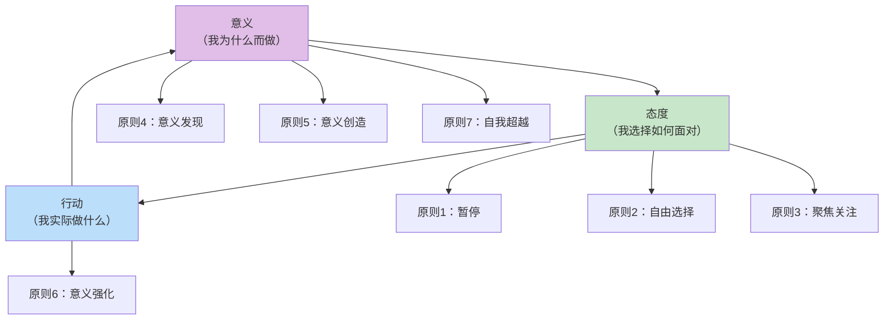
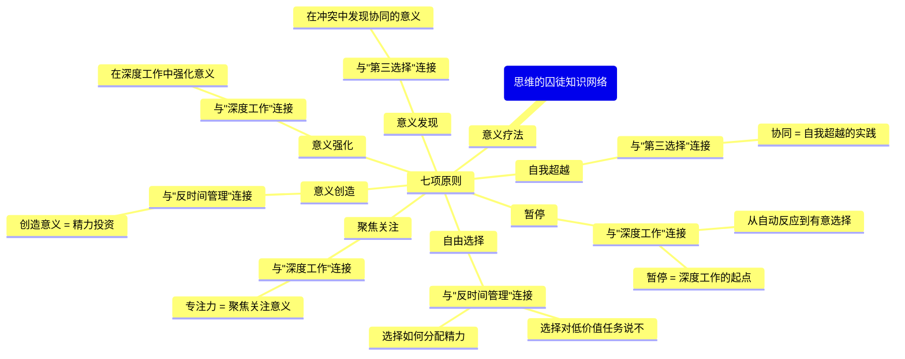
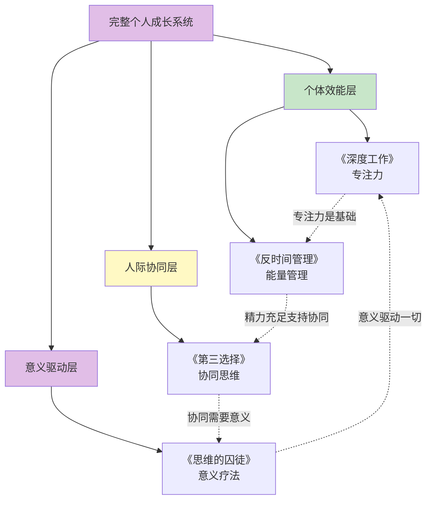

# ◇○《思维的囚徒》核心内容C：意义驱动的系统整合○●

---

## 一、意义疗法的终极框架

### ◆ "意义-态度-行动"三角模型

这是本书的核心整合框架，将七项原则浓缩为一个简洁的行动模型：



### ○ 模型解读

**意义（为什么）**：你对自己工作、生活、关系的理解——"我做这些是为了什么？"
**态度（如何）**：你面对困境时的选择——"我选择以什么态度来面对这件事？"
**行动（做什么）**：你的具体行为——"基于我的意义和态度，我今天做什么？"

这三个要素形成一个循环：
- 你的意义感影响你的态度
- 你的态度影响你的行动
- 你的行动反过来强化或改变你的意义感

---

## 二、与系列其他书籍的深度连接

### ◆ 跨书籍知识网络



### ○ 跨书籍整合框架

| 本书概念 | 在《深度工作》中的应用 | 在《反时间管理》中的应用 | 在《第三选择》中的应用 |
|---------|-------------------|-------------------|-------------------|
| 暂停 | 深度工作前的暂停仪式 | 任务切换前暂停 | 冲突中的暂停 |
| 态度选择 | 选择"我要专注"的态度 | 选择"我管理能量"的态度 | 选择"我要协同"的态度 |
| 聚焦关注 | 关注当下任务 | 关注高价值任务 | 关注对方需求 |
| 意义发现 | 在深度工作中发现意义 | 在精力管理中发现意义 | 在协同中发现意义 |
| 自我超越 | 为更大的目标深度工作 | 为他人的福祉管理精力 | 为共同利益协同 |

---

## 三、四本书的终极整合

### ◆ 完整个人成长系统



### ○ 四层能力金字塔

| 层级 | 能力 | 书籍 | 关键问题 |
|------|------|------|---------|
| 底层 | 专注力 | 《深度工作》 | "我能专注吗？" |
| 第二层 | 能量管理 | 《反时间管理》 | "我在精力最好的时候专注吗？" |
| 第三层 | 协同思维 | 《第三选择》 | "我能与他人协同创造价值吗？" |
| 顶层 | 意义驱动 | 《思维的囚徒》 | "我做这一切是为了什么？" |

---

## 四、意义驱动的日常实践系统

### ◆ 每日意义实践框架

```
早晨（5分钟）：
  ◇ 暂停：深呼吸3次
  ○ 态度选择："今天我选择以什么态度面对？"
  ● 意义设定："今天我想创造什么意义？"

工作中（随时）：
  ◇ 遇到困境时暂停
  ○ 问自己："我能选择什么态度？"
  ● 问自己："这个情境中有什么意义？"

傍晚（5分钟）：
  ◇ 反思日记：今天发现了什么意义？
  ○ 感恩练习：写下3件感恩的事
  ● 自我超越检查：今天我为谁贡献了什么？
```

### ○ 每周意义复盘模板

```
┌─────────────────────────────────────┐
│       每周意义复盘                  │
├─────────────────────────────────────┤
│ ◇ 本周最大的困境：                  │
│   我选择了什么态度？                 │
│                                    │
│ ○ 本周最有意义的时刻：              │
│   为什么它有意义？                   │
│                                    │
│ ● 本周我为他人贡献了什么？          │
│                                    │
│ ◆ 下周我想创造什么意义？            │
│                                    │
│ ◇ 我在哪个原则上需要加强？          │
│   计划如何加强？                     │
└─────────────────────────────────────┘
```

---

## 五、系列终极行动路线图

<div style="background: #f3e5f5; padding: 16px; border-left: 4px solid #9c27b0;">
◆ 四本书，四个维度，一个完整的个人成长系统
</div>

```
第1-3个月：深度工作阶段
  ◇ 每天2小时深度工作
  ○ 建立深度工作仪式
  ● 减少注意力残留

第4-6个月：反时间管理阶段
  ◇ 绘制能量地图
  ○ 在黄金时段深度工作
  ● 实施极简工作法

第7-9个月：第三选择阶段
  ◇ 练习四步协同流程
  ○ 在冲突中寻找第三选择
  ● 用复述技术建立深层沟通

第10-12个月：思维的囚徒阶段
  ◇ 练习"暂停"和"态度选择"
  ○ 在日常工作中发现和创造意义
  ● 实践自我超越

12个月后：完整系统
  ◇ 专注力成为习惯
  ○ 能量管理成为本能
  ● 协同思维成为自然
  ◆ 意义驱动成为人生底色
```

---

<div style="background: #e8f5e9; padding: 16px; border-left: 4px solid #4caf50;">
● 下一节：《思维的囚徒》结尾篇——30天意义发现挑战计划与系列总结
</div>
